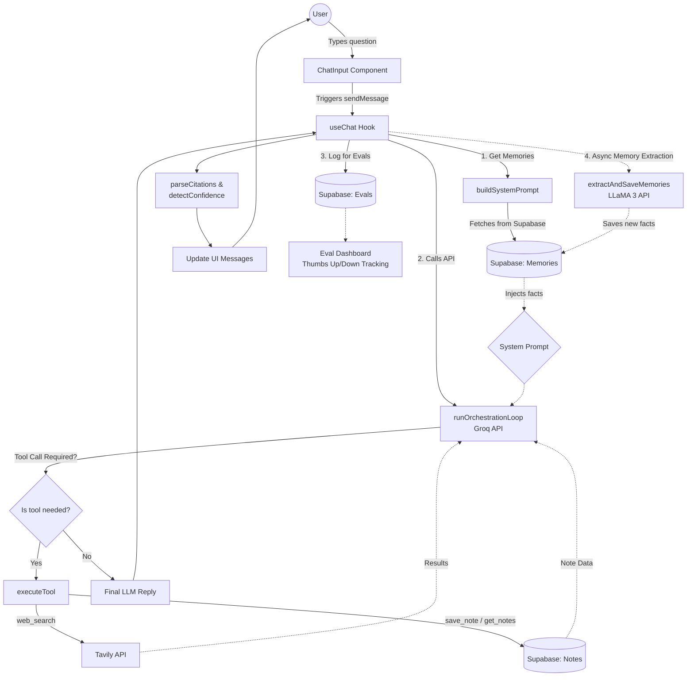

# Orion Chat Flow Architecture

This document outlines the architectural flow of what happens under the hood when a user asks a question in the Orion chat interface. 

It covers the journey from the user's input to the final response, detailing the API calls, tool orchestration, background memory processes, and evaluation logging.

## High-Level Flow Diagram

---

## Detailed Breakdown

### 1. The Entry Point: ChatInput
When you type a question and hit enter, the `<ChatInput />` component triggers the `sendMessage` function inside the `useChat` hook. The UI immediately updates to show the user's message, keeping the interface snappy.

### 2. Pre-Flight: Memory Injection
Before sending the request to the AI, Orion builds a custom `systemPrompt` (in `lib/memory.js`). 
- It fetches the user's **long-term memories** from Supabase.
- These memories are injected directly into the system prompt, giving the AI context about your goals, preferences, and past facts.

### 3. API Call & Orchestration (Groq API)
The history and system prompt are handed to `runOrchestrationLoop` (in `lib/groq.js`).
- This makes a call to the **Groq API** (`moonshotai/kimi-k2-instruct` or configured model).
- **Tool Definitions** are passed along, giving the AI access to specific capabilities.
- **The Loop:** If the AI determines it needs a tool, it returns a `tool_calls` request instead of a final answer. Orion intercepts this, runs the tool, and feeds the results *back* into the AI. This loops until the AI produces a final answer (with a safety limit of 5 iterations).

### 4. Tools Used
When the AI requests a tool, `executeTool` handles the execution (`lib/tools.js`):
- **`web_search`**: Calls the Tavily API to fetch real-time web results for factual accuracy.
- **`save_note`**: Persists text into the Supabase notes database.
- **`get_notes`**: Fetches previously saved notes from Supabase.

### 5. Display & Post-Processing
Once the final reply is generated, Orion checks it for reliability:
- It extracts citations (e.g., `[Source: title, url]`) and evaluates confidence (`lib/trust.js`).
- The cleansed text and citations are appended to the chat UI.

### 6. Evals (Evaluation & Logging)
Every AI response is logged asynchronously to Supabase via `logResponse`. 
- It tracks the prompt, response, latency, and the tools that were used.
- The **EvalDashboard** component reads these logs, allowing administrators or users to review responses, see the thumbs-up/down rates, latency metrics, and investigate failed responses where the model performed poorly.

### 7. Background Memory Extraction
To make the AI smarter over time without slowing down your chat, `extractAndSaveMemories` runs entirely in the background after the reply is shown to the user.
- It passes the recent conversation history to a **Llama-3 70B model** via Groq.
- The model's job is to extract *long-term facts* (max 15 words) that will be relevant in the future.
- If it finds any, they are stored in the Supabase memory database, ready to be injected into the `buildSystemPrompt` during the *next* chat.
